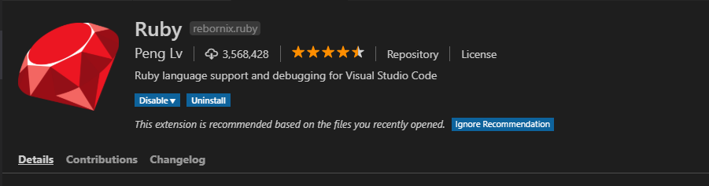
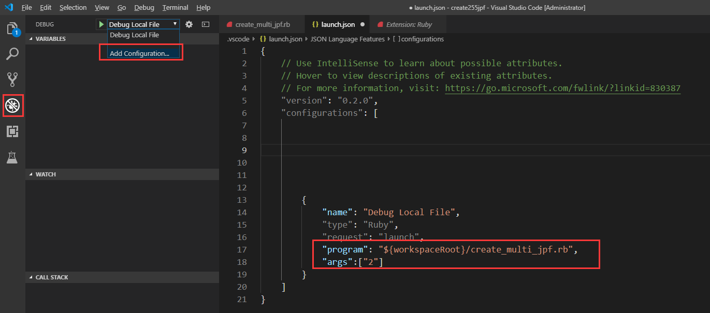

# ruby

### 用vscode调试ruby
> 1. [下载安装ruby的DEVKIT版安装包](https://rubyinstaller.org/downloads/)

> 2. 启动vscode，安装ruby扩展 


> 3. 在cmd下使用下面两个命令安装ruby依赖

```ruby
gem install ruby-debug-ide
gem install debase
```
> 4. 用vscode打开ruby代码的文件夹，打开debug窗口，点击`Debug Local File`菜单下的`Add Configuration`选项,会打开`launch.json`配置文件。


> 5. 设置`launch.json`配置文件
```ruby
"configurations": [ 
        {
            "name": "Debug Local File",
            "type": "Ruby",
            "request": "launch",
            "program": "${workspaceRoot}/create_multi_jpf.rb",  //想要debug的ruby文件
            "args":["2"]  //debug时传递的参数列表
        }
```
> 6. 按F5，选择`Ruby`，开始尽情的debug吧。