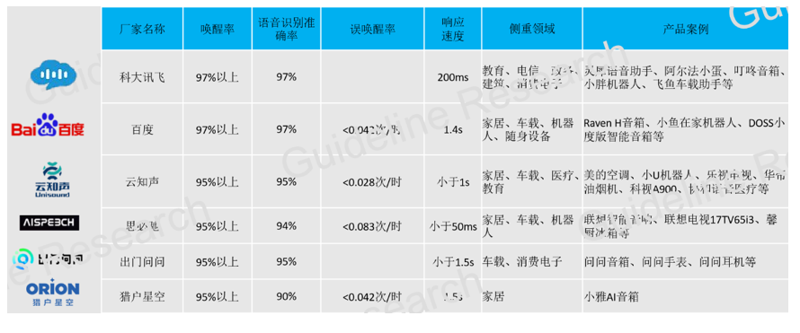
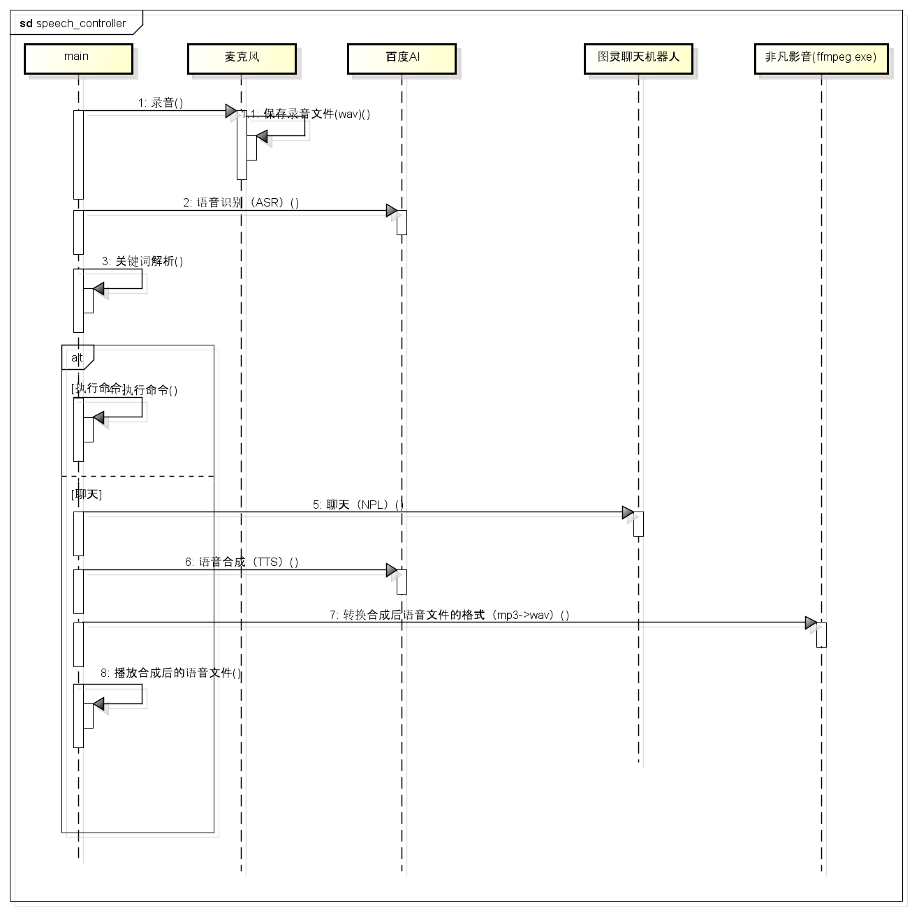

### 使用
1. pip install -r requirement.txt 
2. pip install PyAudio   （如果安装失败，参照`问题1`解决）
3. 将 `ffmpeg.exe` 的路径添加到系统环境变量 `PATH` 中  
3. python speech_controller.py  

### 智能语音简介
#### 概要
人工智能的关键技术均以实现感知智能和认知智能为目标。

语音识别、图像识别和机器人视觉、生物识别等目前最火热的领域，主要解决的是感知智能的需求，就是使得人工智能能够感知周围的世界，能够“听见”或者“看到”。

智能语音主要包括三个模块：自动语音识别技术（automatic speech recognition），自然语言处理 (Natural Language Processing)，文本转语音 (text to speech)

语音交换流程图：


智能语音技术是人工智能产业链上的关键一环。下图是是当前人工智能产业链的一个版图


国内主要的语音识别方案提供方


##### 语音识别（ASR）
##### 自然语义处理（NLP）
##### 语音合成（TTS）

### 设计思路


#### 问题
问题1: Win10系统安装`PyAudio`失败 （`PyAudio`的作用有两个，一个是`SpeechRecognition`需要使用麦克风装置，另一个是需要用`PyAudio`播放百度ai合成后的wav文件）

解决办法：
1. [下载PyAudio](https://www.lfd.uci.edu/~gohlke/pythonlibs/#pyaudio)  
2. pip install PyAudio的whl文件  


问题2: `playsound`不释放资源 （目前已经放弃该方法）

解决办法：
> 修改`playsound.py`文件。
```python
# playsound.py的winCommand函数的 if block:之上添加下面的代码
    while True:
        if winCommand('status', alias, 'mode').decode() == 'stopped':
            winCommand('close', alias)
            break
```